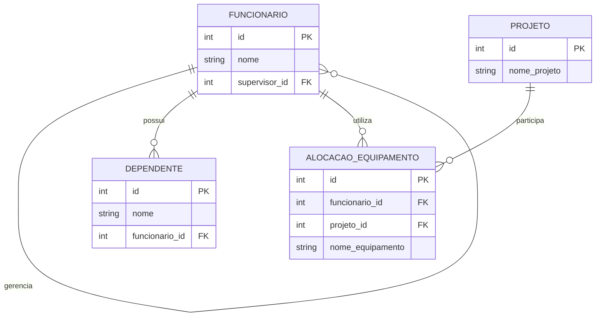

# Sistema de Gestão de Projetos e Equipes

Projeto desenvolvido em PostgreSQL para demonstrar conceitos de modelagem de banco de dados:

- Autorrelacionamento
- Entidade fraca
- Agregação

---

# Autorrelacionamento

A tabela `funcionario` possui um relacionamento com ela mesma através do campo `supervisor_id`.

Isso permite representar hierarquias dentro da empresa, onde um funcionário pode supervisionar outros funcionários.

Exemplo:

- Ana supervisiona Carlos
- Carlos supervisiona João

---

# Dependência de Existência (Entidade Fraca)

A tabela `dependente` depende da existência de um funcionário.

Por isso foi utilizado:

```sql
ON DELETE CASCADE
```

Assim, quando um funcionário é removido, seus dependentes também são removidos automaticamente.

---

# Agregação

A agregação foi utilizada para representar o uso de equipamentos em projetos.

A tabela `alocacao_equipamento` conecta:

- Funcionário
- Projeto
- Equipamento

Isso permite saber qual equipamento está sendo utilizado por determinado funcionário em um projeto específico.

---



# Tecnologias Utilizadas

- PostgreSQL
- SQL
- GitHub
- Mermaid Diagram

---

# Exemplos de Consultas SQL

## Funcionários e Supervisores

```sql
SELECT
    f.nome AS funcionario,
    s.nome AS supervisor
FROM funcionario f
LEFT JOIN funcionario s
ON f.supervisor_id = s.id;
```

## Dependentes

```sql
SELECT
    d.nome AS dependente,
    f.nome AS funcionario
FROM dependente d
JOIN funcionario f
ON d.funcionario_id = f.id;
```

## Equipamentos por Projeto

```sql
SELECT
    f.nome AS funcionario,
    p.nome_projeto,
    a.nome_equipamento
FROM alocacao_equipamento a
JOIN funcionario f
ON a.funcionario_id = f.id
JOIN projeto p
ON a.projeto_id = p.id;
```
