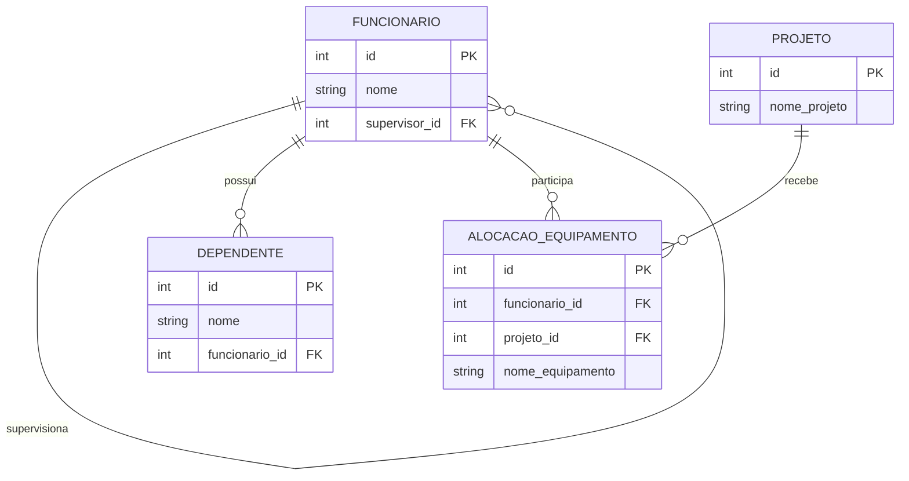

# Sistema de Gestão de Projetos e Equipes

Este projeto foi desenvolvido para representar conceitos de banco de dados relacional, como autorrelacionamento, dependência de existência e agregação.

## Objetivo
Modelar funcionários, dependentes, projetos e equipamentos em um banco PostgreSQL.

## Conceitos aplicados

### 1. Autorrelacionamento
A tabela `funcionario` possui o campo `supervisor_id`, que aponta para o próprio funcionário.  
Isso permite que um funcionário seja supervisor de outro funcionário.

### 2. Dependência de existência
A tabela `dependente` depende da tabela `funcionario`.  
Se um funcionário for excluído, seus dependentes também serão removidos com `ON DELETE CASCADE`.

### 3. Agregação
A tabela `alocacao_equipamento` representa a relação entre `funcionario` e `projeto`, permitindo associar equipamentos a essa combinação.

## Diagrama Mermaid

