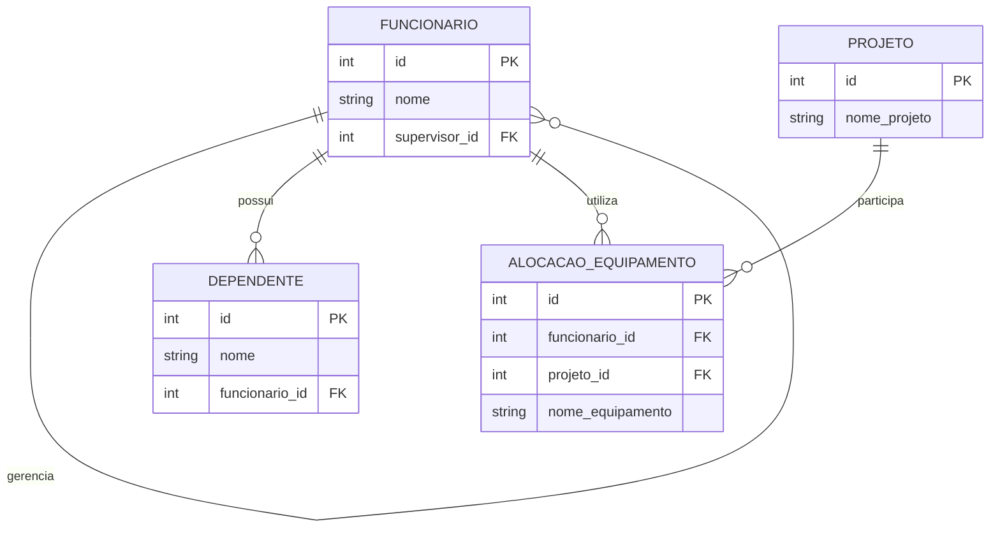

# Sistema de Gestão de Projetos e Equipes

Projeto desenvolvido em PostgreSQL para demonstrar conceitos de modelagem de banco de dados:

- Autorrelacionamento
- Entidade fraca
- Agregação

---

# Objetivo do Projeto

O sistema simula o gerenciamento de funcionários, dependentes, projetos e equipamentos utilizados dentro da empresa.

O projeto foi criado para aplicar conceitos de modelagem conceitual e implementação em banco de dados relacional utilizando PostgreSQL.

---

# Autorrelacionamento

O autorrelacionamento foi aplicado na tabela `funcionario`.

O campo `supervisor_id` referencia a própria tabela, permitindo representar hierarquias entre funcionários.

Exemplo:

- Ana supervisiona Carlos
- Carlos supervisiona João

---

# Dependência de Existência (Entidade Fraca)

A tabela `dependente` depende diretamente da existência de um funcionário.

Foi utilizado:

```sql
ON DELETE CASCADE
```

Isso garante que, ao excluir um funcionário, todos os seus dependentes também sejam removidos automaticamente.

---

# Agregação

A agregação foi aplicada através da tabela `alocacao_equipamento`.

Essa tabela representa a relação entre:

- Funcionário
- Projeto
- Equipamento

Assim, é possível controlar quais equipamentos estão sendo utilizados por funcionários em projetos específicos.

---

# Diagrama ER



---

# Tecnologias Utilizadas

- PostgreSQL
- SQL
- GitHub
- Mermaid

---

# Exemplos de Consultas SQL

## Funcionários e Supervisores

```sql
SELECT
    f.nome AS funcionario,
    s.nome AS supervisor
FROM funcionario f
LEFT JOIN funcionario s
ON f.supervisor_id = s.id;
```

---

## Dependentes e Funcionários

```sql
SELECT
    d.nome AS dependente,
    f.nome AS funcionario
FROM dependente d
JOIN funcionario f
ON d.funcionario_id = f.id;
```

---

## Equipamentos Utilizados em Projetos

```sql
SELECT
    f.nome AS funcionario,
    p.nome_projeto,
    a.nome_equipamento
FROM alocacao_equipamento a
JOIN funcionario f
ON a.funcionario_id = f.id
JOIN projeto p
ON a.projeto_id = p.id;
```
